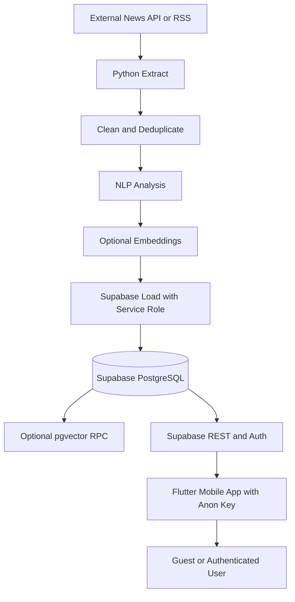
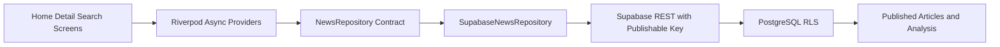
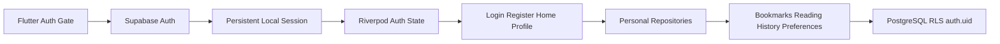
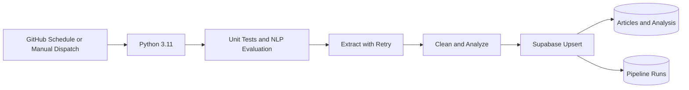
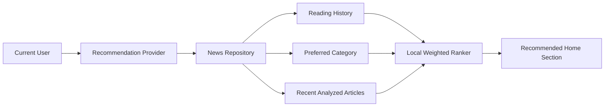
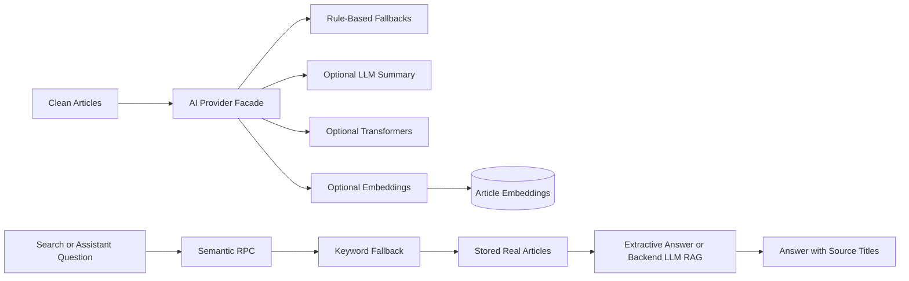
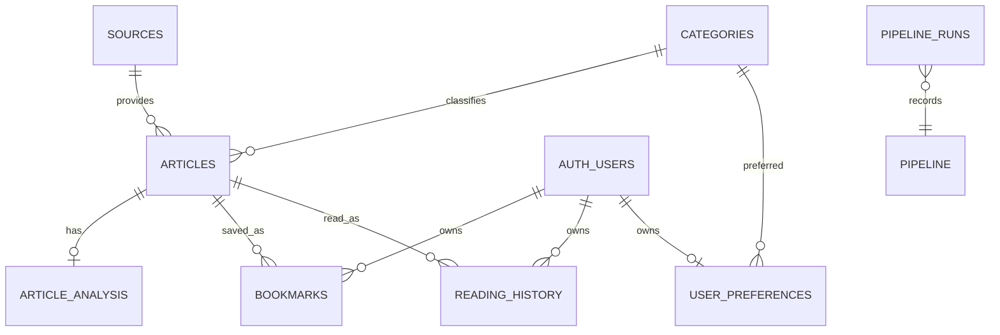

# Architecture

## System Context



## Trust Boundaries

### Mobile Client

- Contains only `SUPABASE_URL` and `SUPABASE_ANON_KEY`.
- Treats all client input as untrusted.
- Relies on RLS rather than hidden UI controls for authorization.
- Reads published articles and writes user-owned rows after authentication.

### Python Pipeline

- Runs locally, in CI, or on a trusted scheduler.
- May use `SUPABASE_SERVICE_ROLE_KEY`.
- May use backend-only LLM and local model configuration.
- Owns article/source/category/analysis writes.
- Must never serialize secrets into output, logs, mobile assets, or Git.
- Records run metadata in a backend-only table after live ingestion.

### Supabase

- Auth supplies the user identity exposed by `auth.uid()`.
- PostgreSQL constraints protect uniqueness and referential integrity.
- RLS protects public publication state and per-user ownership.
- `pipeline_runs` has RLS enabled with no mobile grants or policies.
- Optional `article_embeddings` rows are readable only for published articles.
- Optional semantic RPC returns published article IDs and no rows when pgvector
  is absent.

## Mobile Modules

| Module | Responsibility |
| --- | --- |
| `screens/` | Page composition and navigation entry points |
| `widgets/` | Reusable presentation components |
| `models/` | Typed application and Supabase data contracts |
| `repositories/` | Query contract and Supabase data access implementation |
| `services/` | Supabase and external integration boundaries |
| `providers/` | Riverpod dependency and state ownership |
| `theme/` | Colors, typography, shape, and component defaults |
| `utils/` | Routes, configuration, and formatting helpers |

Phase 2 and Phase 3 implement repository/provider boundaries so widgets never
issue Supabase queries directly.

## Phase 2 Mobile Data Flow



The providers expose:

- `latestArticlesProvider`, optionally filtered by selected category.
- `featuredArticleProvider`.
- `categoriesProvider`.
- `articleDetailProvider(articleId)`.
- `searchArticlesProvider(query)`.
- `newsAssistantAnswerProvider(question)`.
- `recommendedArticlesProvider`.
- `trendingArticlesProvider` and derived `trendingInsightProvider`.
- `relatedArticlesProvider`.

The repository joins `articles`, `sources`, `categories`, and
`article_analysis`. Search first tries the optional semantic RPC with a no-key
deterministic hash query embedding. The RPC filters by embedding provider, so
Flutter only compares hash queries with hash article vectors. If the RPC,
table, matching embeddings, or pgvector are unavailable, it collects matching
article IDs from title, content, summary, topic, and keyword-array queries,
then fetches the complete joined records in publication order.

## Phase 3 Auth and Personal Data Flow



The auth repository wraps `signInWithPassword`, `signUp`, `signOut`, current
user access, and auth-state changes. `supabase_flutter` persists the session;
the auth gate restores it before selecting onboarding or Home.

User-specific providers and actions are:

- `authStateProvider`, `currentUserProvider`, `authControllerProvider`.
- `userBookmarksProvider`, `bookmarkStatusProvider`.
- `readingHistoryProvider`, `profileStatsProvider`.
- `userPreferenceProvider`.

Screens call these providers and action objects. Bookmark, history, and
preference repositories are the only modules that issue writes to their
respective Supabase tables. Reading history uses the unique
`(user_id, article_id)` constraint to update `read_at` on repeated reads.

The mobile app contains only the public Supabase URL and anon/publishable key.
Authorization depends on RLS; the service-role key remains restricted to the
trusted Python pipeline.

## Phase 5 Scheduled Ingestion



GitHub Actions receives `SUPABASE_URL`, `SUPABASE_SERVICE_ROLE_KEY`, optional
news provider keys, and optional LLM settings only from repository secrets.
The service-role key and LLM key are available to the workflow process and
Python client, never to Flutter or repository files.

Live writes isolate individual article failures. The workflow fails on partial
or failed status so operational degradation is visible, while successfully
processed articles remain committed.

## Mobile Network Errors

Android declares `android.permission.INTERNET`. `AppConfig` expects the base
Supabase URL and defensively removes `/rest/v1`. Runtime failures are mapped to
short DNS, timeout, or network messages with a retry action. Debug builds log a
sanitized technical error; release UI and logs never intentionally expose
credentials.

## Phase 4 Recommendation Flow



The ranker excludes read articles when alternatives exist and scores candidates
using preferred category, frequently read categories, topic matches, keyword
overlap, and recency. A guest skips personal queries and receives the trending
ranking. History and preference writes invalidate the recommendation provider.

Trending topics and keywords are derived from the same recent candidate set.
This is an MVP content-frequency signal, not an engagement analytics system.

## Phase 6A AI and RAG Flow



The Python AI provider facade owns summary, sentiment, topic, embedding, and
chat providers. Missing packages, missing keys, provider errors, and pgvector
absence all fall back to local deterministic behavior. The stable
`article_analysis` contract remains `summary`, `sentiment`, `sentiment_score`,
`topic`, and `keywords`; embeddings are stored separately.

RAG is retrieval-first. Retrieval uses semantic search when embeddings exist
and keyword matching otherwise. Generation uses the backend-only LLM provider
only in trusted Python code; without it, answers are extractive summaries from
retrieved articles. Flutter displays the answer and source article titles but
never receives service-role or LLM keys.

## Pipeline Contract

Each stage consumes and returns dictionaries with stable fields:

```text
extract
  title, content, content_is_snippet, url, image_url, source_*, category,
  published_at

clean
  normalized fields + status

analysis
  clean article + analysis {summary, sentiment, score, topic, keywords}

load
  sources -> categories -> articles -> article_analysis -> pipeline_runs
```

Extraction supports NewsAPI, open-data GDELT, and configured RSS feeds. Auto
mode tries those real sources in that order based on credentials, settings,
and provider health. If none returns usable records, the run is logged as
`no_data`; NLP and article loading are skipped.
NLP uses optional remote summaries with local extractive, sentiment, topic, and
keyword fallbacks. The default load mode is dry-run. Live writes require both
the explicit `--live` flag and backend credentials.

## Database Relationships



## Query Direction for Phase 2

1. Mobile requests published articles with joined source, category, and
   analysis.
2. PostgreSQL applies grants and RLS.
3. Repository maps response rows into `ArticleWithAnalysis`.
4. Riverpod exposes loading, error, empty, and data states.
5. Screens render state without owning network logic.

## Deployment Evolution

- Phase 1: local Flutter, manual SQL, dry-run ETL.
- Phase 2: Supabase-backed public feed, detail, category, and search.
- Phase 3: Supabase Auth and user-owned bookmarks/history/preferences
  (implemented).
- Phase 4: real providers, fallback NLP, recommendation, and trending insight
  (implemented).
- Phase 5: scheduling, observability, evaluation, network UX, and fallback
  hardening (implemented).
- Phase 6A: provider-backed AI/NLP, optional embeddings, semantic search, and
  source-grounded News Assistant Q&A (implemented).
- Later release work: live evidence, signed Android release preparation, and
  portfolio presentation.
