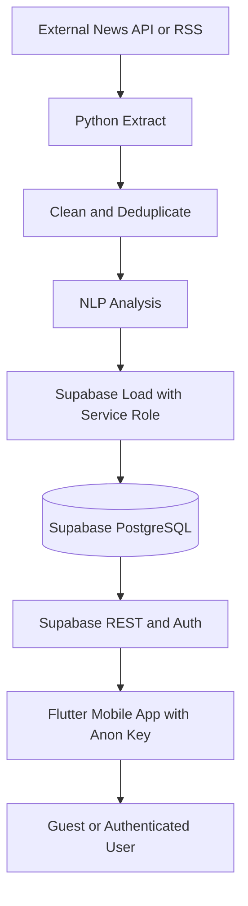
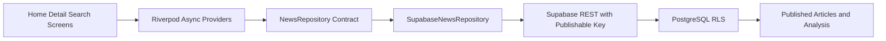
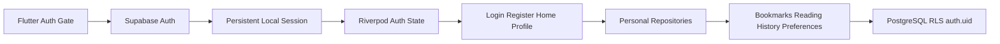
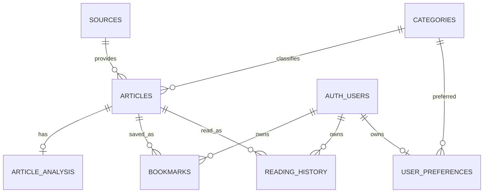

# Architecture

## System Context



## Trust Boundaries

### Mobile Client

- Contains only `SUPABASE_URL` and `SUPABASE_ANON_KEY`.
- Treats all client input as untrusted.
- Relies on RLS rather than hidden UI controls for authorization.
- Reads published articles and writes user-owned rows after authentication.

### Python Pipeline

- Runs locally, in CI, or on a trusted scheduler.
- May use `SUPABASE_SERVICE_ROLE_KEY`.
- Owns article/source/category/analysis writes.
- Must never serialize secrets into output, logs, mobile assets, or Git.

### Supabase

- Auth supplies the user identity exposed by `auth.uid()`.
- PostgreSQL constraints protect uniqueness and referential integrity.
- RLS protects public publication state and per-user ownership.

## Mobile Modules

| Module | Responsibility |
| --- | --- |
| `screens/` | Page composition and navigation entry points |
| `widgets/` | Reusable presentation components |
| `models/` | Typed application and Supabase data contracts |
| `repositories/` | Query contract and Supabase data access implementation |
| `services/` | Supabase and external integration boundaries |
| `providers/` | Riverpod dependency and state ownership |
| `theme/` | Colors, typography, shape, and component defaults |
| `utils/` | Routes, configuration, and formatting helpers |

Phase 2 and Phase 3 implement repository/provider boundaries so widgets never
issue Supabase queries directly.

## Phase 2 Mobile Data Flow



The providers expose:

- `latestArticlesProvider`, optionally filtered by selected category.
- `featuredArticleProvider`.
- `categoriesProvider`.
- `articleDetailProvider(articleId)`.
- `searchArticlesProvider(query)`.

The repository joins `articles`, `sources`, `categories`, and
`article_analysis`. Search first collects matching article IDs from title,
content, summary, topic, and keyword-array queries, then fetches the complete
joined records in publication order.

## Phase 3 Auth and Personal Data Flow



The auth repository wraps `signInWithPassword`, `signUp`, `signOut`, current
user access, and auth-state changes. `supabase_flutter` persists the session;
the auth gate restores it before selecting onboarding or Home.

User-specific providers and actions are:

- `authStateProvider`, `currentUserProvider`, `authControllerProvider`.
- `userBookmarksProvider`, `bookmarkStatusProvider`.
- `readingHistoryProvider`, `profileStatsProvider`.
- `userPreferenceProvider`.

Screens call these providers and action objects. Bookmark, history, and
preference repositories are the only modules that issue writes to their
respective Supabase tables. Reading history uses the unique
`(user_id, article_id)` constraint to update `read_at` on repeated reads.

The mobile app contains only the public Supabase URL and anon/publishable key.
Authorization depends on RLS; the service-role key remains restricted to the
trusted Python pipeline.

## Pipeline Contract

Each stage consumes and returns dictionaries with stable fields:

```text
extract
  title, content, url, image_url, source_*, category, published_at

clean
  normalized fields + status

analysis
  clean article + analysis {summary, sentiment, score, topic, keywords}

load
  sources -> categories -> articles -> article_analysis
```

The default load mode is dry-run. Live writes require both the explicit
`--live` flag and backend credentials.

## Database Relationships



## Query Direction for Phase 2

1. Mobile requests published articles with joined source, category, and
   analysis.
2. PostgreSQL applies grants and RLS.
3. Repository maps response rows into `ArticleWithAnalysis`.
4. Riverpod exposes loading, error, empty, and data states.
5. Screens render state without owning network logic.

## Deployment Evolution

- Phase 1: local Flutter, manual SQL, dry-run ETL.
- Phase 2: Supabase-backed public feed, detail, category, and search.
- Phase 3: Supabase Auth and user-owned bookmarks/history/preferences
  (implemented).
- Phase 4: real providers and GitHub Actions/cron scheduling.
- Phase 5-6: evaluated NLP and recommendation jobs.
- Phase 7: signed Android release and portfolio assets.
